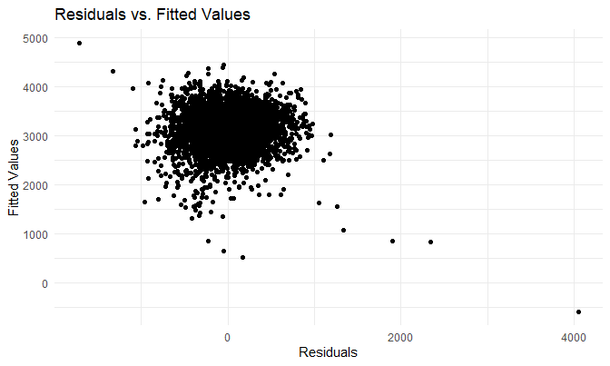
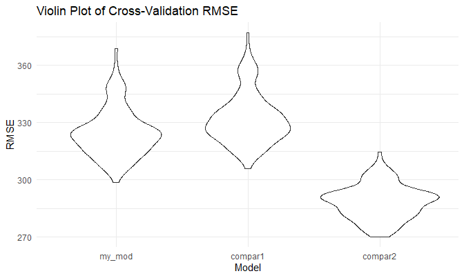
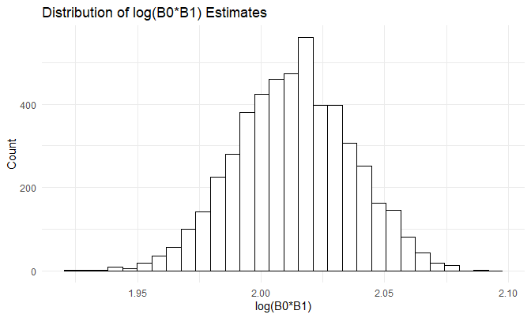
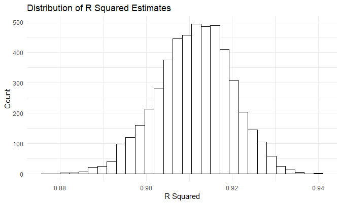

P8105 Homework 6
================
Rachel Heise
12/6/2020

## Problem 1

``` r
homicide_df = 
  read_csv("data/homicide-data.csv", na = c("", "NA", "Unknown")) %>% 
  mutate(
    city_state = str_c(city, state, sep = ", "),
    victim_age = as.numeric(victim_age),
    resolution = case_when(
      disposition == "Closed without arrest" ~ 0,
      disposition == "Open/No arrest"        ~ 0,
      disposition == "Closed by arrest"      ~ 1)
  ) %>% 
  filter(
    victim_race %in% c("White", "Black"),
    city_state != "Tulsa, AL") %>% 
  select(city_state, resolution, victim_age, victim_race, victim_sex)
```

Starting with one city

``` r
baltimore_df =
  homicide_df %>% 
  filter(city_state == "Baltimore, MD")

glm(resolution ~ victim_age + victim_race + victim_sex,
    data = baltimore_df,
    family = binomial()) %>% 
  broom::tidy() %>% 
  mutate(
    OR = exp(estimate),
    CI_lower = exp(estimate - 1.96*std.error),
    CI_upper = exp(estimate + 1.96*std.error)
  ) %>% 
  select(term, OR, starts_with("CI")) %>% 
  knitr::kable(digits = 3)
```

| term              |    OR | CI\_lower | CI\_upper |
| :---------------- | ----: | --------: | --------: |
| (Intercept)       | 1.363 |     0.975 |     1.907 |
| victim\_age       | 0.993 |     0.987 |     1.000 |
| victim\_raceWhite | 2.320 |     1.648 |     3.268 |
| victim\_sexMale   | 0.426 |     0.325 |     0.558 |

Try this across cities

``` r
models_results_df = 
  homicide_df %>% 
  nest(data = -city_state) %>% 
  mutate(
    models = 
      map(.x = data, ~glm(resolution ~ victim_age + victim_race + victim_sex, data = .x, family = binomial())),
    results = map(models, broom::tidy)
  ) %>% 
  select(city_state, results) %>% 
  unnest(results) %>% 
  mutate(
    OR = exp(estimate),
    CI_lower = exp(estimate - 1.96 * std.error),
    CI_upper = exp(estimate + 1.96 * std.error)
  ) %>% 
  select(city_state, term, OR, starts_with("CI")) 
```

``` r
models_results_df %>% 
  filter(term == "victim_sexMale") %>% 
  mutate(city_state = fct_reorder(city_state, OR)) %>% 
  ggplot(aes(x = city_state, y = OR)) +
  geom_point() +
  geom_errorbar(aes(ymin = CI_lower, ymax = CI_upper)) +
  theme(axis.text.x = element_text(angle = 90, vjust = 0.5, hjust = 1)) +
  labs(title = "Odds Ratio by City")
```


## Problem 2

Build 3 models and compare them using cross-validation.

``` r
baby_df =
  read_csv("./data/birthweight.csv") %>% 
  mutate(babysex = as.factor(babysex),
         frace = as.factor(frace),
         malform = as.factor(malform),
         mrace = as.factor(mrace),
         babysex = recode(babysex, `1` = "male", `2` = "female"),
         frace = recode(frace, `1` = "White", `2` = "Black", `3` = "Asian", `4` = "Puerto Rican", `8` = "Other", `9` = "Unknown"),
         malform = recode(malform, `0` = "absent", `1` = "present"),
         mrace = recode(mrace, `1` = "White", `2` = "Black", `3` = "Asian", `4` = "Puerto Rican", `8` = "Other")) 
  
pairs(~bwt + blength + gaweeks + delwt + fincome, data = baby_df, main = "Scatterplot Matrix for Baby Data")
```


To create my model, I looked at a scatterplot matrix with hypothesized
variables that could help predict birthweight, to get an understanding
of what the relationship between possible predictors and the response
might be. From this plot and hypotheses about the relationships between
variables, I decided to include baby’s length at birth, mother’s race,
and mother’s weight at delivery.

``` r
my_model = lm(bwt ~ blength + mrace + delwt, data = baby_df)
summary(my_model)
```

    ## 
    ## Call:
    ## lm(formula = bwt ~ blength + mrace + delwt, data = baby_df)
    ## 
    ## Residuals:
    ##     Min      1Q  Median      3Q     Max 
    ## -1711.2  -215.7    -5.5   206.5  4051.1 
    ## 
    ## Coefficients:
    ##                     Estimate Std. Error t value Pr(>|t|)    
    ## (Intercept)       -3616.4233    94.1852 -38.397  < 2e-16 ***
    ## blength             128.0416     1.9077  67.120  < 2e-16 ***
    ## mraceBlack         -177.1317    10.4759 -16.909  < 2e-16 ***
    ## mraceAsian          -28.7131    50.5211  -0.568     0.57    
    ## mracePuerto Rican   -90.1831    22.2158  -4.059 5.01e-05 ***
    ## delwt                 3.0493     0.2317  13.163  < 2e-16 ***
    ## ---
    ## Signif. codes:  0 '***' 0.001 '**' 0.01 '*' 0.05 '.' 0.1 ' ' 1
    ## 
    ## Residual standard error: 326.5 on 4336 degrees of freedom
    ## Multiple R-squared:  0.5942, Adjusted R-squared:  0.5937 
    ## F-statistic:  1270 on 5 and 4336 DF,  p-value: < 2.2e-16

Plot residuals vs. fitted values for my model.

``` r
baby_df %>% 
  modelr::add_residuals(my_model) %>% 
  modelr::add_predictions(my_model) %>% 
  ggplot(aes(x = resid, y = pred)) +
  geom_point() +
  labs(
    x = "Residuals",
    y = "Fitted Values",
    title = "Residuals vs. Fitted Values"
  )
```



Fit two comparison models.

``` r
model_fit1 = lm(bwt ~ blength + gaweeks, data = baby_df) %>% broom::tidy()
model_fit2 = lm(bwt ~ (bhead + blength + babysex)^3, data = baby_df) %>% broom::tidy()
```

``` r
cv_df = crossv_mc(baby_df, 100)

cv_df = 
  cv_df %>% 
  mutate(
    train = map(train, as_tibble),
    test = map(test, as_tibble)
  )


cv_df = 
  cv_df %>% 
  mutate(
    my_mod = map(train, ~lm(bwt ~ blength + gaweeks + mrace, data = .x)),
    compar_mod1 = map(train, ~lm(bwt ~ blength + gaweeks, data = .x)),
    compar_mod2 = map(train, ~lm(bwt ~ (bhead + blength + babysex)^3, data = .x))
  ) %>% 
  mutate(
    rmse_my_mod = map2_dbl(my_mod, test, ~rmse(model = .x, data = .y)),
    rmse_compar1 = map2_dbl(compar_mod1, test, ~rmse(model = .x, data = .y)),
    rmse_compar2 = map2_dbl(compar_mod2, test, ~rmse(model = .x, data = .y)))


cv_df %>% 
  select(starts_with("rmse")) %>% 
  pivot_longer(
    everything(),
    names_to = "model", 
    values_to = "rmse",
    names_prefix = "rmse_") %>% 
  mutate(model = fct_inorder(model)) %>% 
  ggplot(aes(x = model, y = rmse)) +
  geom_violin() +
  labs(title = "Violin Plot of Cross-Validation RMSE",
       x = "Model",
       y = "RMSE")
```



The second comparison model, with predictors head circumference, length,
sex, and all their interactions, has the overall lowest RMSE values. My
model fared only slightly better than the first comparison model.
Picking between these three models, I would choose the second comparison
model.

## Problem 3

``` r
weather_df = 
  rnoaa::meteo_pull_monitors(
    c("USW00094728"),
    var = c("PRCP", "TMIN", "TMAX"), 
    date_min = "2017-01-01",
    date_max = "2017-12-31") %>%
  mutate(
    name = recode(id, USW00094728 = "CentralPark_NY"),
    tmin = tmin / 10,
    tmax = tmax / 10) %>%
  select(name, id, everything())
```

Create linear models for 5000 bootstraps and calculate R squared and
log(B0\*B1) values.

``` r
weather_boot = weather_df %>% 
  bootstrap(5000, id = "strap_number") %>% 
  mutate(
    models = map(.x = strap, ~lm(tmax ~ tmin, data = .x)),
    results = map(models, broom::tidy),
    result_desc = map(models, broom::glance)
  ) %>% 
  unnest(result_desc,
         results) %>% 
  select(strap_number, term, estimate, r.squared) %>% 
  pivot_wider(
    names_from = "term",
    values_from = "estimate"
  ) %>% 
  rename(intercept = "(Intercept)") %>% 
  mutate(log_est = log(intercept*tmin))
```

Create histogram of log(B0\*B1) values.

``` r
weather_boot %>% 
  ggplot(aes(x = log_est)) +
  geom_histogram(color = "black", fill = "white") +
  labs(title = "Distribution of log(B0*B1) Estimates",
       x = "log(B0*B1)",
       y = "Count")
```

    ## `stat_bin()` using `bins = 30`. Pick better value with `binwidth`.



Create histogram of r squared values.

``` r
weather_boot %>% 
  ggplot(aes(x = r.squared)) +
  geom_histogram(color = "black", fill = "white") +
  labs(title = "Distribution of R Squared Estimates",
       x = "R Squared",
       y = "Count")
```

    ## `stat_bin()` using `bins = 30`. Pick better value with `binwidth`.



Both of these distributions look quite normally distributed. The
distribution of r squared estimates looks like it may be slightly
left-skewed, but overall still looks normal.

Find quantiles to create 95% confidence intervals for these two metrics.

``` r
quantile(weather_boot$r.squared, c(0.025, 0.5, 0.975))
```

    ##      2.5%       50%     97.5% 
    ## 0.8936977 0.9115941 0.9274807

``` r
quantile(weather_boot$log_est, c(0.025, 0.5, 0.975))
```

    ##     2.5%      50%    97.5% 
    ## 1.966942 2.013439 2.058528

The estimate for r squared is 0.9116, and the estimate for log(B0 \* B1)
is 2.0134. The 95% confidence interval for R squared is (0.8937, 0.9275)
and for log(B0\*B1) it is (1.9669, 2.0585).
