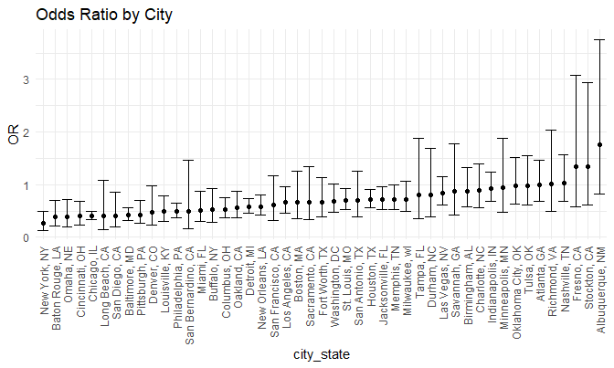
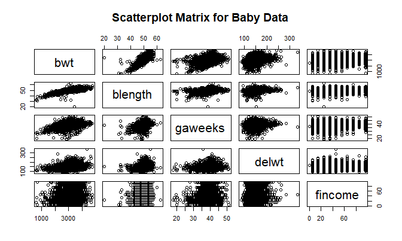
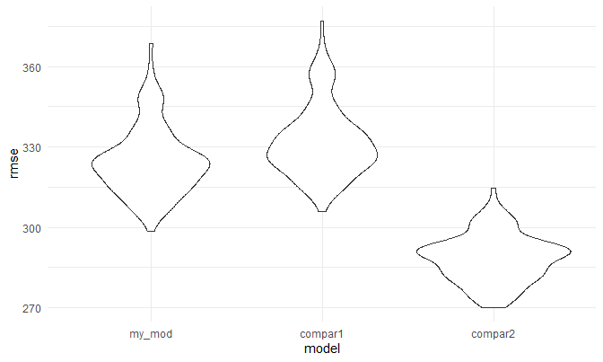

P8105 Homework 6
================
Rachel Heise
11/23/2020

## Problem 1

``` r
homicide_df = 
  read_csv("data/homicide-data.csv", na = c("", "NA", "Unknown")) %>% 
  mutate(
    city_state = str_c(city, state, sep = ", "),
    victim_age = as.numeric(victim_age),
    resolution = case_when(
      disposition == "Closed without arrest" ~ 0,
      disposition == "Open/No arrest"        ~ 0,
      disposition == "Closed by arrest"      ~ 1)
  ) %>% 
  filter(
    victim_race %in% c("White", "Black"),
    city_state != "Tulsa, AL") %>% 
  select(city_state, resolution, victim_age, victim_race, victim_sex)
```

    ## Parsed with column specification:
    ## cols(
    ##   uid = col_character(),
    ##   reported_date = col_double(),
    ##   victim_last = col_character(),
    ##   victim_first = col_character(),
    ##   victim_race = col_character(),
    ##   victim_age = col_double(),
    ##   victim_sex = col_character(),
    ##   city = col_character(),
    ##   state = col_character(),
    ##   lat = col_double(),
    ##   lon = col_double(),
    ##   disposition = col_character()
    ## )

Starting with one city

``` r
baltimore_df =
  homicide_df %>% 
  filter(city_state == "Baltimore, MD")

glm(resolution ~ victim_age + victim_race + victim_sex,
    data = baltimore_df,
    family = binomial()) %>% 
  broom::tidy() %>% 
  mutate(
    OR = exp(estimate),
    CI_lower = exp(estimate - 1.96*std.error),
    CI_upper = exp(estimate + 1.96*std.error)
  ) %>% 
  select(term, OR, starts_with("CI")) %>% 
  knitr::kable(digits = 3)
```

| term              |    OR | CI\_lower | CI\_upper |
| :---------------- | ----: | --------: | --------: |
| (Intercept)       | 1.363 |     0.975 |     1.907 |
| victim\_age       | 0.993 |     0.987 |     1.000 |
| victim\_raceWhite | 2.320 |     1.648 |     3.268 |
| victim\_sexMale   | 0.426 |     0.325 |     0.558 |

Try this across cities

``` r
models_results_df = 
  homicide_df %>% 
  nest(data = -city_state) %>% 
  mutate(
    models = 
      map(.x = data, ~glm(resolution ~ victim_age + victim_race + victim_sex, data = .x, family = binomial())),
    results = map(models, broom::tidy)
  ) %>% 
  select(city_state, results) %>% 
  unnest(results) %>% 
  mutate(
    OR = exp(estimate),
    CI_lower = exp(estimate - 1.96 * std.error),
    CI_upper = exp(estimate + 1.96 * std.error)
  ) %>% 
  select(city_state, term, OR, starts_with("CI")) 
```

``` r
models_results_df %>% 
  filter(term == "victim_sexMale") %>% 
  mutate(city_state = fct_reorder(city_state, OR)) %>% 
  ggplot(aes(x = city_state, y = OR)) +
  geom_point() +
  geom_errorbar(aes(ymin = CI_lower, ymax = CI_upper)) +
  theme(axis.text.x = element_text(angle = 90, vjust = 0.5, hjust = 1))
```



## Problem 2

Build 3 models (choose one of your own). Compare them using
cross-validation.

``` r
baby_df =
  read_csv("./data/birthweight.csv") %>% 
  mutate(babysex = as.factor(babysex),
         frace = as.factor(frace),
         malform = as.factor(malform),
         mrace = as.factor(mrace),
         babysex = recode(babysex, `1` = "male", `2` = "female"),
         frace = recode(frace, `1` = "White", `2` = "Black", `3` = "Asian", `4` = "Puerto Rican", `8` = "Other", `9` = "Unknown"),
         malform = recode(malform, `0` = "absent", `1` = "present"),
         mrace = recode(mrace, `1` = "White", `2` = "Black", `3` = "Asian", `4` = "Puerto Rican", `8` = "Other")) 
```

    ## Parsed with column specification:
    ## cols(
    ##   .default = col_double()
    ## )

    ## See spec(...) for full column specifications.

``` r
pairs(~bwt + blength + gaweeks, data = baby_df, main = "Name")
```


Fit a model Look at residuals - does it look symmetrical? Any outliers?
Any trends (parabolas)?

``` r
my_model = lm(bwt ~ blength + gaweeks + mrace, data = baby_df)
my_model
```

    ## 
    ## Call:
    ## lm(formula = bwt ~ blength + gaweeks + mrace, data = baby_df)
    ## 
    ## Coefficients:
    ##       (Intercept)            blength            gaweeks         mraceBlack  
    ##          -3955.71             124.62              23.93            -152.28  
    ##        mraceAsian  mracePuerto Rican  
    ##            -93.19            -100.09

``` r
baby_df %>% 
  modelr::add_residuals(my_model) %>% 
  modelr::add_predictions(my_model) %>% 
  ggplot(aes(x = resid, y = pred)) +
  geom_point() +
  labs(
    x = "Residuals",
    y = "Fitted Values",
    title = "Residuals vs. Fitted Values"
  )
```


``` r
baby_df %>% 
  modelr::add_residuals(my_model) %>% 
  ggplot(aes(x = gaweeks, y = resid)) +
  geom_point()
```


``` r
model_fit1 = lm(bwt ~ gaweeks, data = baby_df) %>% broom::tidy()
model_fit2 = lm(bwt ~ (bhead + blength + babysex)^3, data = baby_df) %>% broom::tidy()
```

``` r
cv_df = crossv_mc(baby_df, 100)

cv_df = 
  cv_df %>% 
  mutate(
    train = map(train, as_tibble),
    test = map(test, as_tibble)
  )


cv_df = 
  cv_df %>% 
  mutate(
    my_mod = map(train, ~lm(bwt ~ blength + gaweeks + mrace, data = .x)),
    compar_mod1 = map(train, ~lm(bwt ~ blength + gaweeks, data = .x)),
    compar_mod2 = map(train, ~lm(bwt ~ (bhead + blength + babysex)^3, data = .x))
  ) %>% 
  mutate(
    rmse_my_mod = map2_dbl(my_mod, test, ~rmse(model = .x, data = .y)),
    rmse_compar1 = map2_dbl(compar_mod1, test, ~rmse(model = .x, data = .y)),
    rmse_compar2 = map2_dbl(compar_mod2, test, ~rmse(model = .x, data = .y)))


cv_df %>% 
  select(starts_with("rmse")) %>% 
  pivot_longer(
    everything(),
    names_to = "model", 
    values_to = "rmse",
    names_prefix = "rmse_") %>% 
  mutate(model = fct_inorder(model)) %>% 
  ggplot(aes(x = model, y = rmse)) +
  geom_violin()
```



## Problem 3

``` r
weather_df = 
  rnoaa::meteo_pull_monitors(
    c("USW00094728"),
    var = c("PRCP", "TMIN", "TMAX"), 
    date_min = "2017-01-01",
    date_max = "2017-12-31") %>%
  mutate(
    name = recode(id, USW00094728 = "CentralPark_NY"),
    tmin = tmin / 10,
    tmax = tmax / 10) %>%
  select(name, id, everything())
```

    ## Registered S3 method overwritten by 'hoardr':
    ##   method           from
    ##   print.cache_info httr

    ## using cached file: C:\Users\rache\AppData\Local\Cache/R/noaa_ghcnd/USW00094728.dly

    ## date created (size, mb): 2020-10-01 11:20:57 (7.534)

    ## file min/max dates: 1869-01-01 / 2020-09-30

Fit a model to data set. Make sure you can compute adjusted R^2 and log
(B0B1). Use broom::glance(). Get your estimated coefficients and
rearrange with intercept and slope next to each other. Then do bootstrap
method
